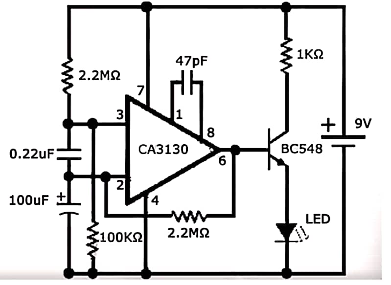

# RF Mobile Phone Detector

## Overview
The **RF Mobile Phone Detector** is an analog electronic system designed to detect electromagnetic radiation emitted by active mobile communication devices. Mobile phones continuously transmit radio frequency (RF) signals during operations such as calls, messaging, and data communication.

This circuit detects those RF emissions and provides a **visual indication when a mobile phone is actively transmitting nearby**. The detector operates in the **800 MHz – 2.5 GHz frequency range**, which covers common cellular communication bands used by modern mobile devices.

Weak RF signals present in the surrounding environment are captured, amplified, and processed to trigger an indicator when the signal strength exceeds a predefined threshold.

---

## Objective

- Detect RF emissions from nearby mobile phones during active communication.
- Design a **simple and low-cost analog RF detection circuit**.
- Demonstrate practical RF signal sensing using analog electronic components.
- Provide a visual alert when mobile phone activity is detected.

---

## Working Principle

The detector circuit senses electromagnetic radiation emitted by nearby mobile devices using a **sensing network connected to a CA3130 operational amplifier**.

The **CA3130 op-amp** functions as a high-gain amplifier that boosts weak RF signals captured from the environment. When the detected signal exceeds a predefined threshold, the amplified output drives a **BC548 transistor**, which operates as a switching element.

Once the transistor is activated, it powers an **LED indicator**, providing a visual signal that RF activity has been detected nearby.

---

## Components Used

| Component | Description |
|-----------|-------------|
| CA3130 Operational Amplifier | High-input impedance op-amp used for RF signal amplification |
| BC548 Transistor | NPN transistor used as a switching device |
| Resistors | 100 kΩ, 2.2 MΩ, 1 kΩ |
| Capacitors | 47 pF, 0.22 µF, 100 µF |
| LED | Visual indicator for RF signal detection |
| 9V Battery | Power supply for the circuit |
| Breadboard / PCB | Platform for circuit assembly |

---

## Applications

- Monitoring unauthorized mobile phone usage in **examination halls**
- Security enforcement in **restricted areas**
- RF monitoring in **hospitals and ICUs** where wireless interference must be minimized
- Detection of mobile activity in **confidential meeting rooms and secure facilities**

---

## Future Improvements

- Increase detection range using improved **antenna structures**
- Add **audio alerts or buzzers** for better notification
- Implement **signal filtering techniques** to reduce false detections
- Develop a **microcontroller-based RF monitoring system** for enhanced accuracy

---

## Circuit Diagram

---

## Author

**Thirjesi Keerthi Sree**  
Electronics Engineering Student  
